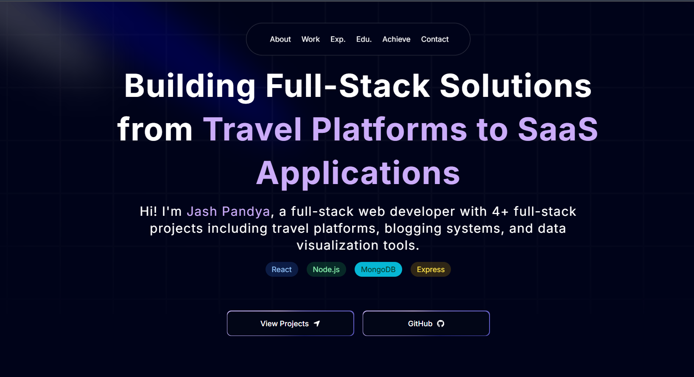

# 🚀 Jashkumar Pandya - Portfolio Website

A modern, responsive portfolio website showcasing my journey as a full-stack developer. Built with cutting-edge technologies and featuring smooth animations, interactive elements, and a comprehensive display of my projects and achievements.

## 🌐 Live Demo

**[View Live Portfolio](https://pandya-portfolio.vercel.app/)**

## 📸 Preview

## ✨ Features

- **Modern Design**: Clean, professional interface with smooth animations
- **Responsive Layout**: Fully optimized for desktop, tablet, and mobile devices
- **Interactive Animations**: Powered by Framer Motion for engaging user experience
- **Project Showcase**: Detailed presentation of 6+ full-stack projects
- **Professional Timeline**: Work experience and educational journey visualization
- **Achievement Section**: Academic accomplishments and recognitions
- **Contact Integration**: Easy ways to connect and collaborate

## 🛠️ Tech Stack

- **Framework**: [Next.js 14](https://nextjs.org/) - React framework for production
- **Styling**: [Tailwind CSS](https://tailwindcss.com/) - Utility-first CSS framework
- **Animations**: [Framer Motion](https://www.framer.com/motion/) - Motion library for React
- **Deployment**: [Vercel](https://vercel.com/) - Platform for frontend frameworks
- **Language**: TypeScript/JavaScript
- **Icons**: Lucide React icons

## 🎨 Key Sections

### 1. Hero Section
- Professional introduction
- Call-to-action buttons
- Smooth scrolling navigation

### 2. Projects Portfolio
Featured projects including:
- **Meet.AI**: AI-Powered Video Conferencing SaaS
- **Quill**: AI-Powered Blogging Platform (MERN Stack)
- **Wanderlust**: Travel Listing Platform
- **Excel Analytics Platform**: React-based dashboard
- **AtmosVue**: Weather Dashboard
- **Todo List**: Task Management App

### 3. Experience Timeline
- Development philosophy
- Project workflow methodology
- Client collaboration approach

### 4. Education & Achievements
- Academic background (B.E. Computer Engineering)
- Awards and recognitions
- Community involvement

## 📞 Contact

**Jash Pandya**
- Portfolio: [https://jashpandya-portfolio.vercel.app/](https://pandya-portfolio.vercel.app/)
- LinkedIn: [Connect with me](https://linkedin.com/in/jashpandya)
- Email: jashpandyaa@gmail.com

## 📝 License

This project is licensed under the MIT License - see the [LICENSE](LICENSE) file for details.

## 🙏 Acknowledgments

- Framer Motion for amazing animations
- Tailwind CSS for rapid styling
- Next.js team for the fantastic framework
- Vercel for seamless deployment
- All open source contributors

---

⭐ **If you found this project helpful, please give it a star!** ⭐
